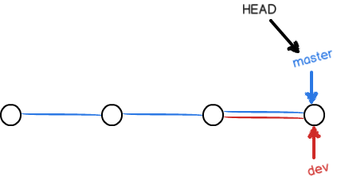

<!-- TOC -->

- [Git](#git)
    - [流程](#%E6%B5%81%E7%A8%8B)
    - [安装](#%E5%AE%89%E8%A3%85)
    - [建立远程仓库并连接](#%E5%BB%BA%E7%AB%8B%E8%BF%9C%E7%A8%8B%E4%BB%93%E5%BA%93%E5%B9%B6%E8%BF%9E%E6%8E%A5)
        - [连接方式](#%E8%BF%9E%E6%8E%A5%E6%96%B9%E5%BC%8F)
            - [SSH密钥方式](#ssh%E5%AF%86%E9%92%A5%E6%96%B9%E5%BC%8F)
            - [HTTPS方式](#https%E6%96%B9%E5%BC%8F)
    - [时光机](#%E6%97%B6%E5%85%89%E6%9C%BA)
        - [工作区和暂存区](#%E5%B7%A5%E4%BD%9C%E5%8C%BA%E5%92%8C%E6%9A%82%E5%AD%98%E5%8C%BA)
            - [工作区（Working Directory）](#%E5%B7%A5%E4%BD%9C%E5%8C%BAworking-directory)
            - [版本库（Repository）](#%E7%89%88%E6%9C%AC%E5%BA%93repository)
        - [版本回退](#%E7%89%88%E6%9C%AC%E5%9B%9E%E9%80%80)
        - [修改](#%E4%BF%AE%E6%94%B9)
    - [向远程仓库上传](#%E5%90%91%E8%BF%9C%E7%A8%8B%E4%BB%93%E5%BA%93%E4%B8%8A%E4%BC%A0)
    - [从远程仓库拉取](#%E4%BB%8E%E8%BF%9C%E7%A8%8B%E4%BB%93%E5%BA%93%E6%8B%89%E5%8F%96)
    - [分支管理](#%E5%88%86%E6%94%AF%E7%AE%A1%E7%90%86)
        - [分支管理实际操作](#%E5%88%86%E6%94%AF%E7%AE%A1%E7%90%86%E5%AE%9E%E9%99%85%E6%93%8D%E4%BD%9C)
        - [解决冲突](#%E8%A7%A3%E5%86%B3%E5%86%B2%E7%AA%81)
        - [用远程拉取文件的方式恢复已经提交的删除](#%E7%94%A8%E8%BF%9C%E7%A8%8B%E6%8B%89%E5%8F%96%E6%96%87%E4%BB%B6%E7%9A%84%E6%96%B9%E5%BC%8F%E6%81%A2%E5%A4%8D%E5%B7%B2%E7%BB%8F%E6%8F%90%E4%BA%A4%E7%9A%84%E5%88%A0%E9%99%A4)
        - [禁用快速合并](#%E7%A6%81%E7%94%A8%E5%BF%AB%E9%80%9F%E5%90%88%E5%B9%B6)
        - [git stash命令](#git-stash%E5%91%BD%E4%BB%A4)
        - [多人开发中](#%E5%A4%9A%E4%BA%BA%E5%BC%80%E5%8F%91%E4%B8%AD)
    - [merge和rebase (合并和衍合)](#merge%E5%92%8Crebase-%E5%90%88%E5%B9%B6%E5%92%8C%E8%A1%8D%E5%90%88)
    - [rebase的次级命令](#rebase%E7%9A%84%E6%AC%A1%E7%BA%A7%E5%91%BD%E4%BB%A4)

<!-- /TOC -->

# Git

## 流程
  

## 安装
官网链接: <https://git-scm.com/>  
可以选择安装TortoiseGit以及汉化包, 可能需要注意安装的先后顺序: <https://tortoisegit.org/download/>  
安装之后, 在右键Settings中设置中文

## 建立远程仓库并连接
github建立仓库, 靠本能!  

### 连接方式

#### SSH密钥方式
如果需要与GitHub的远程仓库建立连接, 使用SSH方式时需要:  
生成 ssh-key，选加密算法（rsa、dsa），给密钥命名（可选）：  

    ssh-keygen -t rsa
    或者
    ssh-keygen -t rsa -C "name"
会在操作系统用户目录下的.ssh 下生成 id_rsa, id_rsa.pub 两个文件，分别是 私钥/公钥。  
公钥需保存到远程服务器(github在Settings左侧栏中SSH and GPG keys中设置)，私钥由客户端本地留存。  

本地仓库下运行:  

    $ git remote add origin git@github.com........................

以后 origin 就是远程仓库的代名词  

#### HTTPS方式
靠本能去搞就行!

## 时光机

### 工作区和暂存区

#### 工作区（Working Directory）
电脑里能看到的目录，任何一个文件夹都  "可以"  是一个工作区, 只要这个文件夹建立了本地仓库, 运行git init之后, 这个文件夹就是工作区.

#### 版本库（Repository）
工作区会有一个隐藏目录.git，这个不算工作区，而是Git的版本库。  

Git的版本库里存了很多东西，其中最重要的就是称为stage（或者叫index）的暂存区，还有Git为我们自动创建的第一个分支master，以及指向master的一个指针叫HEAD。
  

我们把文件往Git版本库里添加的时候，是分两步执行的：

第一步是用 git add 把文件添加进去，实际上就是把文件修改添加到暂存区；  
第二步是用 git commit 提交更改，实际上就是把暂存区的所有内容提交到当前分支。  

因为我们创建Git版本库时，Git自动为我们创建了唯一一个master分支，所以，现在，git commit就是往master分支上提交更改。

可以简单理解为，需要提交的文件修改通通放到暂存区，然后，一次性提交暂存区的所有修改。

### 版本回退
当我们使用 git add ...和  git commit....之后, 如果反悔, 可以使用git log 查看所有的版本(包括提交到远端的版本)  

    使用git reset --hard HEAD^ 返回上一版本, 两个^^, 返回上上个版本  

返回前一百个版本

    git reset --hard HEAD~100

**注意: 当我们使用git reset 回到以前的版本, 再次使用git log就无法显示曾经最新的版本了**

    如果要再次回到未来, 就需要 git reset --hard 版本号

版本号可以从git log窗口中查询, 曾经最新的已经不再显示, 可以使用:

    git reflog

版本号可以简写成前几位.

### 修改

    git status 查看暂存区
    git ls-files 查看本地仓库

场景1:

    修改了工作区的文件, 未add到暂存区, 想要与本地仓库同步
    git checkout  --filename
    该命令可以放弃对工作区的修改

场景2:

    修改了工作区的文件, 已经add到暂存区, 又做出修改,文件始终未commit到本地仓库, 想要让工作区与暂存区一样, 与场景1一样的操作.
    git checkout  --filename

场景1和场景2说明了:  **git checkout  --filename  让这个文件回到最近一次git commit或git add时的状态**  

仔细思考上面这句话, 删除一个文件并add, 通过该命令是找不回来的, 因为最近一次的git add的状态是该文件已被删除的状态, 如果我们提交到本地了, git commit的状态也是已经删除的状态, 一样使用这个命令找不回来.  
此时,如果没有commit, 只是add暂存区中, 使用git reset HEAD 文件名, 可以放弃暂存区中的修改, 再使用git checkout --filename就行了.  
如果已经commit 就可以使用上面的版本回退.

## 向远程仓库上传

git add 指令用于把工作区的文件加载到暂存区  

git commit 用于把暂存区提交到本地, -m 用于添加注释  

git push -u origin master 将本地仓库推送到远程仓库,使用 -u 选项, 不仅会把文件推送过去, 还会建立本地与 orgin远程的关联.  

如此可以理解下面的操作:  
  

## 从远程仓库拉取
git clone git@github.com...........

## 分支管理
每次提交，Git都把它们串成一条时间线，这条时间线就是一个分支。一开始，只有一条时间线，在Git里，这个分支叫主分支，即master分支。HEAD严格来说不是指向提交，而是指向master，master才是指向提交的，所以，HEAD指向的就是当前分支。

一开始的时候，master分支是一条线，Git用master指向最新的提交，再用HEAD指向master，就能确定当前分支，以及当前分支的提交点：  

  

每次提交，master分支都会向前移动一步，这样，随着你不断提交，master分支的线也越来越长。

当我们创建新的分支，例如dev时，Git新建了一个指针叫dev，指向master相同的提交，再把HEAD指向dev，就表示当前分支在dev上：

  

Git创建一个分支很快，因为除了增加一个dev指针，改改HEAD的指向，工作区的文件都没有任何变化！

不过，从现在开始，对工作区的修改和提交就是针对dev分支了，比如新提交一次后，dev指针往前移动一步，而master指针不变：

  

假如我们在dev上的工作完成了，就可以把dev合并到master上。Git怎么合并呢？最简单的方法，就是直接把master指向dev的当前提交，就完成了合并：

  

所以Git合并分支也很快！就改改指针，工作区内容也不变！

合并完分支后，甚至可以删除dev分支。删除dev分支就是把dev指针给删掉，删掉后，我们就剩下了一条master分支：

  

### 分支管理实际操作
创建分支

    -- 创建本地分支并切换到该分支
    git checkout -b 分支名称
    -b参数表示创建并切换，相当于以下两条命令：
    git branch dev
    git checkout dev

    --创建远程分支
    先创建本地分支
    本地分支推送到远程服务器时，远程分支自动创建，推送本地分支到远程
    git push --set-upstream <remote-name> <local-branch-name>:<remote-branch-name>
            * <remote-name>：远程git服务器名称，一般设为origin
            * <local-branch-name>：本地分支名称
            * <remote-branch-name>：远程分支名称
    一般情况下，本地分支和远程分支名称相同，所以可简化为
    git push --set-upstream <remote-name> <branch-name>
    --set-upstream 参数用来关联本地分支和远程分支
查看分支：

    git branch 查看本地分支
    当前分支会在前面有一个*号
    git branch -a 查看远程和本地所有分支
    git branch -r 查看远程分支
删除分支:  

    --删除远程分支
    git branch -r -d origin/branch-name    --先删除本地的分支
    git push origin :branch-name               -- 再推送到远程, 远程相对应的分支也就不存在了, 与创建远程分支是相同的操作原理.
合并分支:  

    git merge 目标分支
    合并目标分支到当前分支, 合并前通常先进行分支切换.  
  
fast-forward 表示当前为快速合并

### 解决冲突
当需要合并的两个分支发生同一个文件的相同位置的更改时, 将无法进行"快速合并".  
当前的分支会进入merging状态, 冲突文件中已经标出冲突;  
解决冲突后一次普通的提交就能完成合并.

### 用远程拉取文件的方式恢复已经提交的删除
git checkout origin/branch_name filename 当删除本地文件并且已经提交, 也可以使用这种方式从远程拉取.  
当然可以使用版本回退也可以.  

### 禁用快速合并
在合并时如果没有冲突, 系统将采用快速合并, 但快速合并的记录将在分支删除后消失, 如果不想丢失记录, 就在合并时使用 --no-ff

    git merge --no-ff -m "merge with no-ff" dev 合并dev分支到当前分支
    使用--no-ff, git会在merge时生成一个新的commit，这样，从分支历史上就可以看出分支信息。
    --由于需要生成新的commit, 所以需要-m ,为本次commit加备注.  

### git stash命令   
git stash可以允许我们在不提交的情况下切换到其他分支.  
使用git stash list查看列表, 可以多次stash, 使用git stash pop或者git stash apply来回到刚刚的工作中, 前者不会删除对应的stash记录.    

    git stash apply stash@{0} 指定回到哪一次
    git stash pop stash@{0}  同上, 但是删除list中的那一条记录

    git stash clear 清空记录

### 多人开发中
如果我们要提交代码:  

    首先，可以试图用git push origin <branch-name>推送自己的修改；

    如果推送失败，则因为远程分支比你的本地更新，需要先用git pull试图合并；

    如果合并有冲突，则解决冲突，并在本地提交；

    没有冲突或者解决掉冲突后，再用git push origin <branch-name>推送就能成功！

    如果git pull提示no tracking information，则说明本地分支和远程分支的链接关系没有创建，用命令git branch --set-upstream-to <branch-name> origin/<branch-name>。

## merge和rebase (合并和衍合)
* 使用merge的方式进行合并, 会在合并点处产生一次commit. 解决完冲突,先`git add .`,再`git commit`.
* 使用rebase的方式, 不会产生额外的commit, 解决完冲突, 先`git add .`,再`git rebase --continue`.缺点是如果当前分支存在多次提交, 需要重复处理多次冲突.

**注意:** 如果使用merge, 只有在产生冲突时, 才会发现产生了commit, 不存在冲突时是不会产生commit, 如果想要不产生冲突也生成commit, 需要使用`git merge --no-ff`

对于rebase的冲突为什么会产生多次, 如下图:  

我们首先切换分支到dev, 企图将master的代码rebase到dev, 此时系统会以e为基准, 比较c到e的修改和c到1的修改, 这会产生一个结果`1'`, 再以这个commit, 即`1'`为基准,1到2的修改与刚刚的结果进行冲突校验, 一次次的冲突就是因为当前分支的下一个commit与上次解决冲突产生的结果比较发现的.
  
等到一切冲突都解决完成, 就会发现dev变化了, master的commit嵌入了dev.

## rebase的次级命令

|简写|全写|描述|
|---|---|---|
| p | pick |使用commit|
| r | reword |使用commit,但重新编辑该commit的注释|
| e | edit |使用commit,但rabse操作执行到该commit时会暂停,用户在此commit基础上进行内容修改(当然也可以不修改)后,执行`git add 目标文件`和`git commit --amend`更新注释,然后执行`git rebase --continue`继续未完成的rebase操作|
| s | squash |使用commit, 但将其合并到前一个commit,合并时自动汇总该commit与上一个commit的注释,用户可以进行二次编辑|
| f | fixup |与squash相似,但是合并后,丢弃本commit的注释|
| d | drop |丢弃该commit|

git rebase -i HEAD~3 过去3次提交合并为1次

    git rebase -i [开始] [结束] 
    - i,意为--interactive
    支持使用commitId, 不指定结束默认使用当前commit, 注意,这个区间前开后闭.

-----------------------以下部分需要实际验证----------------

如果想把client并入master, 而不想带入server的commit,如下

  
不想C3进入master, 直接rebase client一定会带入C3, 使用 `git rebase --onto master server client`

可能是下面的原因:
git rebase --onto 分支1 分支2 分支3
比较分支2和3, 找到各自分支的不同点, 分支2有自己的commit, 分支3也有自己的commit, 然后使用分支3的不同的commit, rebase到分支1, 可以成功的剔除了2和3的相同的commit.

--onto的另一种用法
git rebase   [startpoint]   [endpoint]  --onto  [branchName]
当前分支的左开右闭区间, 移植到另一个分支

-----------------------以上部分需要实际验证----------------

