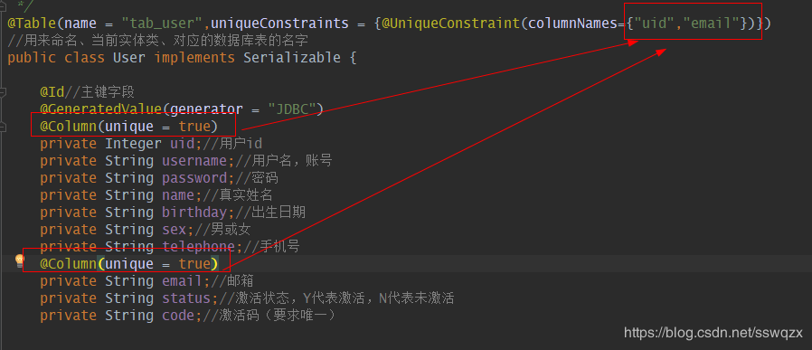

# Hibernate

## 简介

### 什么是JPA

JPA （Java Persistence API）Java持久化API。是一套Sun公司Java官方制定的ORM 方案,是规范，是标准 ，sun公司自己并没有实现

### 什么是ORM

ORM（Object Relational Mapping）对象关系映射。

## 快速开始

### 1.引入项目 pom.xml

    <!--使用Hibernate-->
    <dependency>
        <groupId>org.springframework.boot</groupId>
        <artifactId>spring-boot-starter-data-jpa</artifactId>
    </dependency>

### 2.配置文件

需要配置数据库:

    # 数据库配置
    spring.datasource.url=jdbc:oracle:thin:@127.0.0.1:1521:orcl
    spring.datasource.username=C##ACTIVITIUSER
    spring.datasource.password=******
    spring.datasource.driver-class-name=oracle.jdbc.driver.OracleDriver

### 3.建立表的实体类

  
注意: 实体类需要@Id这个注解, 否则会报异常

### 4.持久层

    import cn.xlf.workflow.entity.StudentsEntity;
    import org.springframework.data.jpa.repository.JpaRepository;

    /**
     * @author 类中域:徐林飞
     * @date 2020/3/9 14:27
     */
    public interface StudentsDao extends JpaRepository<StudentsEntity,String> {
    }

### 5.使用

无论是Service层还是Controller层都可以使用Dao进行增删改查.
  

## 相关注解

### 1.@Column

用来标识实体类中属性与数据表中字段的对应关系.
@Column属性详解：

    name
    定义了被标注字段在数据库表中所对应字段的名称；

    unique
    表示该字段是否为唯一标识，默认为false。如果表中有一个字段需要唯一标识，则既可以使用该标记，也可以使用@Table标记中的@UniqueConstraint。

    nullable
    表示该字段是否可以为null值，默认为true。

    insertable
    表示在使用“INSERT”脚本插入数据时，是否需要插入该字段的值。

    updatable
    表示在使用“UPDATE”脚本插入数据时，是否需要更新该字段的值。insertable和updatable属性一般多用于只读的属性，例如主键和外键等。这些字段的值通常是自动生成的。

    columnDefinition（大多数情况，几乎不用）
    表示创建表时，该字段创建的SQL语句，一般用于通过Entity生成表定义时使用。（也就是说，如果DB中表已经建好，该属性没有必要使用。）

    table
    表示当映射多个表时，指定表的表中的字段。默认值为主表的表名。

    length
    表示字段的长度，当字段的类型为varchar时，该属性才有效，默认为255个字符。

    precision和scale
    precision属性和scale属性表示精度，当字段类型为double时，precision表示数值的总长度，scale表示小数点所占的位数。

### 2.@Table

声明此对象映射到数据库的数据表，通过它可以为实体指定表(table).
常用的两个属性：

    1. name 用来命名 当前实体类 对应的数据库 表的名字
    2. uniqueConstraints 用来批量命名唯一键
    其作用等同于多个：@Column(unique = true)

  
  

### 3.@Transient

该注解用于标识不希望存到数据库中的字段.

> 1）一旦变量被transient修饰，变量将不再是对象持久化的一部分，该变量内容在序列化后无法获得访问。
> 2）transient关键字只能修饰变量，而不能修饰方法和类。注意，本地变量是不能被transient关键字修饰的。变量如果是用户自定义类变量，则该类需要实现Serializable接口。
> 3）被transient关键字修饰的变量不再能被序列化，一个静态变量不管是否被transient修饰，均不能被序列化。

## 通过表自动生成实体类

这里使用IDEA, 进行生成:  
1. 首先添加hibernate.cfg.xml文件;

2. IDEA连接数据库:
  
3. 通过Persistence进行实体类生成

4. 配置之后点击确定即可

## 通过实体类自动建表

  
