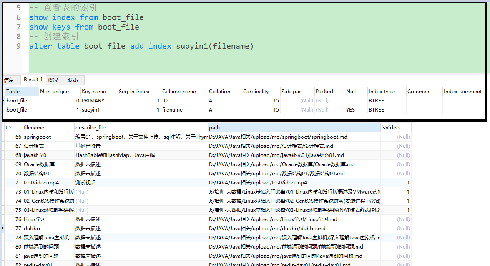
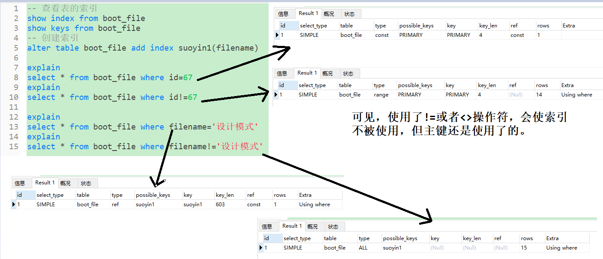
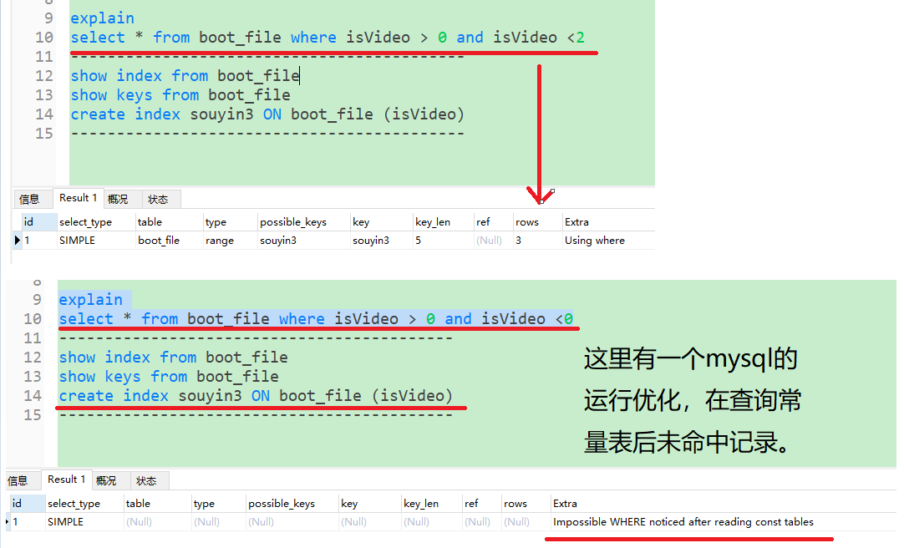
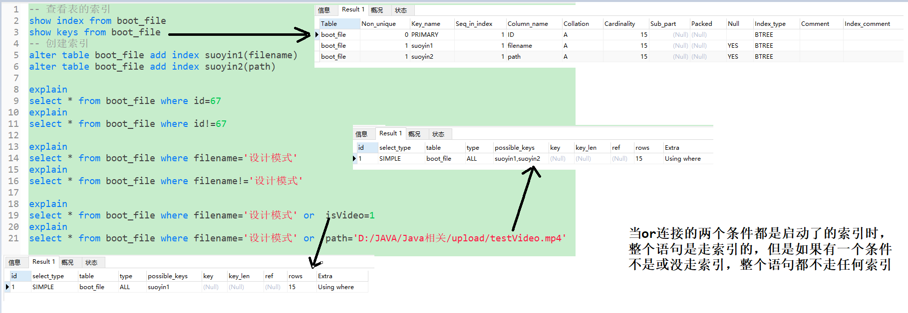
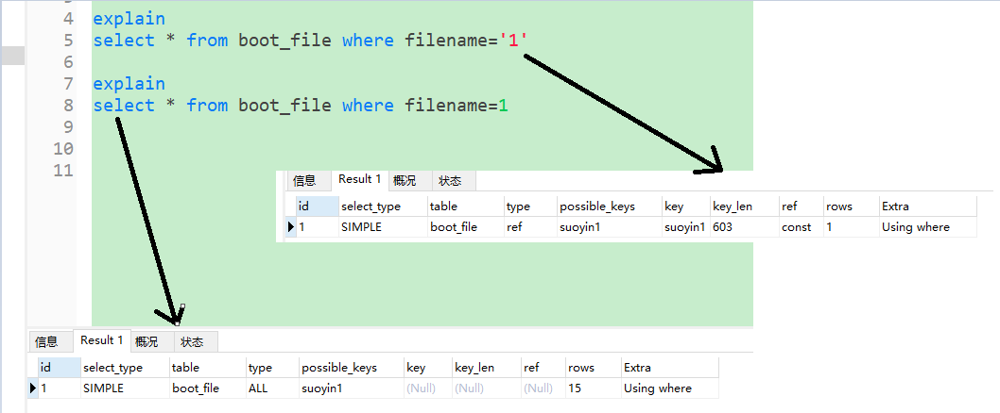
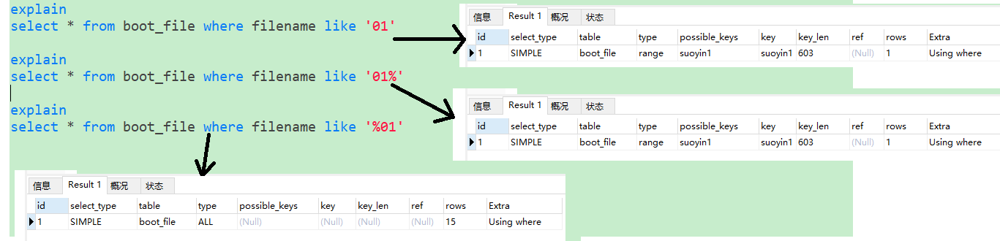
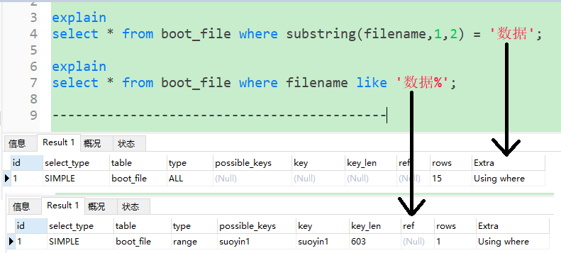

# MySQL
#### MySQL
如果使用where 与 limit 能达到目的，就尽量避免使用limit a,b  
where xxxx>a limit b 性能优于 limit a,b
## 字符串拼接
concat(str1,str2,str3.............)  
concat_ws('分隔符',str1,str2,str3.......)  
[相关链接](https://www.cnblogs.com/lanqingzhou/p/8275399.html)
## 分组排序
	create table xulinfei (id int PRIMARY key not null auto_increment ,name varchar(18),created_time datetime);

	insert into xulinfei(name,created_time)values('1111',sysdate());
	insert into xulinfei(name,created_time)values('2222',sysdate());
	insert into xulinfei(name,created_time)values('1111',sysdate());
	insert into xulinfei(name,created_time)values('2222',sysdate());
	insert into xulinfei(name,created_time)values('1111',sysdate());
	insert into xulinfei(name,created_time)values('3333',sysdate());
	insert into xulinfei(name,created_time)values('3333',sysdate());
	insert into xulinfei(name,created_time)values('4444',sysdate());
	
	select * from xulinfei a where created_time=(select max(created_time) from xulinfei where name=a.name);
## and 与 or 的执行顺序
关系型运算符优先级高到低为：NOT >AND >OR  
## 索引
### 作用
加快数据定位的速度，提高查询效率
### 创建索引
	-- 创建普通索引  
	alter table table_name add index index_name(column_list);  
	-- 创建UNIQUE索引  
	alter table table_name add UNIQUE(column_list);  
	-- 创建PRIMARY KEY索引    
	alter table table_name add PRIMARY KEY(column_list);
>其中table_name是要增加索引的表名，column_list指出对哪些列进行索引，多列时各列之间用逗号分隔。索引名index_name可选，缺省时，MySQL将根据第一个索引列赋一个名称。另外，ALTER TABLE允许在单个语句中更改多个表，因此可以在同时创建多个索引。

	CREATE INDEX可对表增加普通索引或UNIQUE索引。
	CREATE INDEX index_name ON table_name (column_list)
	CREATE UNIQUE INDEX index_name ON table_name (column_list)

>table_name、index_name和column_list具有与ALTER TABLE语句中相同的含义，索引名不可缺省。另外，不能用CREATE INDEX语句创建PRIMARY KEY索引。
### 索引类型
在创建索引时，可以规定索引能否包含重复值。如果不包含，则索引应该创建为PRIMARY KEY或UNIQUE索引。对于单列惟一性索引，这保证单列不包含重复的值。对于多列惟一性索引，保证多个值的组合不重复。

PRIMARY KEY 索引和 UNIQUE 索引非常类似。事实上，PRIMARY KEY索引仅是一个具有名称PRIMARY的UNIQUE索引。这表示一个表只能包含一个PRIMARY KEY，因为一个表中不可能具有两个同名的索引。
### 查看索引
	show index from table_name
	或者show keys from table_name
    
· Table 表的名称。  
· Non_unique 如果索引不能包括重复词，则为0。如果可以，则为1。  
· Key_name 索引的名称。  
· Seq_in_index 索引中的列序列号，从1开始。  
· Column_name 列名称。  
· Collation 列以什么方式存储在索引中。在MySQL中，有值‘A’（升序）或NULL（无分类）。  
· Cardinality 索引中唯一值的数目的估计值。通过运行ANALYZE TABLE或myisamchk -a可以更新。基数根据被存储为整数的统计数据来计数，所以即使对于小型表，该值也没有必要是精确的。基数越大，当进行联合时，MySQL使用该索引的机会就越大。  
· Sub_part 如果列只是被部分地编入索引，则为被编入索引的字符的数目。如果整列被编入索引，则为NULL。  
· Packed 指示关键字如何被压缩。如果没有被压缩，则为NULL。  
· Null 如果列含有NULL，则含有YES。如果没有，则该列含有NO。  
· Index_type 用过的索引方法（BTREE, FULLTEXT, HASH, RTREE）。  
· Comment 多种评注。  
### 删除索引
可利用ALTER TABLE或DROP INDEX语句来删除索引。类似于CREATE INDEX语句，DROP INDEX可以在ALTER TABLE内部作为一条语句处理，语法如下。

	DROP INDEX index_name ON talbe_name
	ALTER TABLE table_name DROP INDEX index_name
	ALTER TABLE table_name DROP PRIMARY KEY

其中，前两条语句是等价的，删除掉table_name中的索引index_name。

第3条语句只在删除PRIMARY KEY索引时使用，因为一个表只可能有一个PRIMARY KEY索引，因此不需要指定索引名。如果没有创建PRIMARY KEY索引，但表具有一个或多个UNIQUE索引，则MySQL将删除第一个UNIQUE索引。

如果从表中删除了某列，则索引会受到影响。对于多列组合的索引，如果删除其中的某列，则该列也会从索引中删除。如果删除组成索引的所有列，则整个索引将被删除。
### 索引方法
MySQL目前主要有以下几种索引方法：B-Tree，Hash，R-Tree。

一、B-Tree  
B-Tree是最常见的索引类型，所有值（被索引的列）都是排过序的，每个叶节点到跟节点距离相等。所以B-Tree适合用来查找某一范围内的数据，而且可以直接支持数据排序（ORDER BY）  
B-Tree在MyISAM里的形式和Innodb稍有不同：  
MyISAM表数据文件和索引文件是分离的，索引文件仅保存数据记录的磁盘地址  
InnoDB表数据文件本身就是主索引，叶节点data域保存了完整的数据记录
 
二、Hash索引  
1.仅支持"=","IN"和"<=>"精确查询，不能使用范围查询：  
由于Hash索引比较的是进行Hash运算之后的Hash值，所以它只能用于等值的过滤，不能用于基于范围的过滤，因为经过相应的Hash算法处理之后的Hash  
2.不支持排序：  
由于Hash索引中存放的是经过Hash计算之后的Hash值，而且Hash值的大小关系并不一定和Hash运算前的键值完全一样，所以数据库无法利用索引的数据来避免任何排序运算  
3.在任何时候都不能避免表扫描：  
由于Hash索引比较的是进行Hash运算之后的Hash值，所以即使取满足某个Hash键值的数据的记录条数，也无法从Hash索引中直接完成查询，还是要通过访问表中的实际数据进行相应的比较，并得到相应的结果  
4.检索效率高，索引的检索可以一次定位，不像B-Tree索引需要从根节点到枝节点，最后才能访问到页节点这样多次的IO访问，所以Hash索引的查询效率要远高于B-Tree索引  
5.只有Memory引擎支持显式的Hash索引，但是它的Hash是nonunique的，冲突太多时也会影响查找性能。  Memory引擎默认的索引类型即是Hash索引，虽然它也支持B-Tree索引  

三、R-Tree索引  
R-Tree在MySQL很少使用，仅支持geometry数据类型，支持该类型的存储引擎只有MyISAM、BDb、InnoDb、NDb、Archive几种。

### explain
explain 查看数据库执行计划  
explain执行的sql之后,可以看到显示的行，具体含义：  
>table：sql关于的表  
>type:type：这是重要的列，显示连接使用了何种类型。从最好到最差的连接类型为：const、eq_reg、ref、range、indexhe和ALL  
>possible_keys：显示可能应用在这张表中的索引。如果为空，没有可能的索引。可以为相关的域从where语句中选择一个合适的语句  
>key： 实际使用的索引。如果为NULL，则没有使用索引。很少的情况下，MySQL会选择优化不足的索引。这种情况下，可以在Select语句中使用USE INDEX（indexname）来强制使用一个索引或者用IGNORE INDEX（indexname）来强制MySQL忽略索引    
>key_len：使用的索引的长度。在不损失精确性的情况下，长度越短越好；  
>ref：显示索引的哪一列被使用了，如果可能的话，是一个常数；  
>rows：MySQL认为必须检查的用来返回请求数据的行数；  
>Extra：关于MySQL如何解析查询的额外信息。  
### 哪些情况下索引不会生效
1.应尽量避免在 where 子句中使用 != 或 <> 操作符，否则引擎将放弃使用索引而进行全表扫描； 
  
可以把<>拆开，使用and连接，索引就会走了。  
  
2.尽量避免在 where 子句中使用 or 来连接条件，否则将导致引擎放弃使用索引而进行全表扫描，即使其中有条件带索引也不会使用，这也是为什么尽量少用 or 的原因；
  
3、对于多列索引，不是使用的第一部分，则不会使用索引；  
4、如果列类型是字符串，那一定要在条件中将数据使用引号引用起来，否则不会使用索引；
  
5、5、like的模糊查询以 % 开头，索引失效；  
  
6、应尽量避免在 where 子句中对字段进行表达式操作，这将导致引擎放弃使用索引而进行全表扫描；  
如：

	select id from t where num/2 = 100 
应改为:  

	select id from t where num = 100*2；
7、应尽量避免在 where 子句中对字段进行函数操作，这将导致引擎放弃使用索引而进行全表扫描；  
  
8、不要在 where 子句中的 “=” 左边进行函数、算术运算或其他表达式运算，否则系统将可能无法正确使用索引；  
9、如果MySQL估计使用全表扫描要比使用索引快，则不使用索引；  
10、不适合键值较少的列（重复数据较多的列）  

