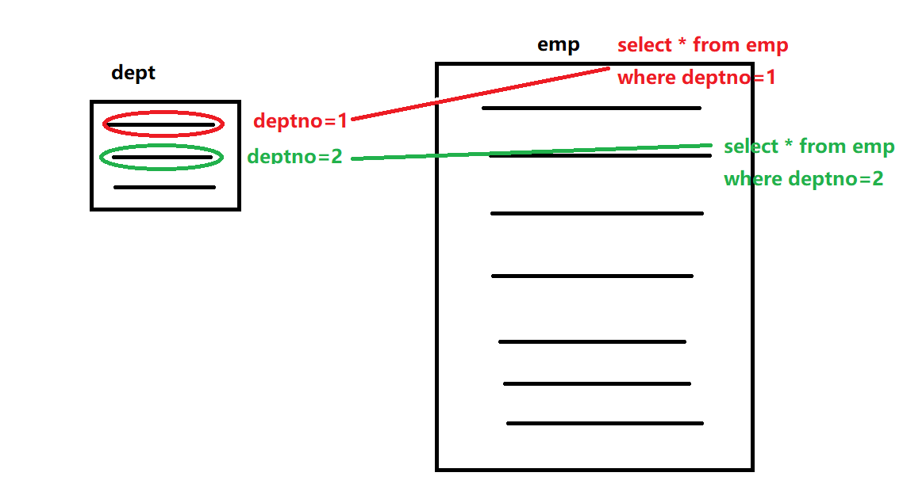
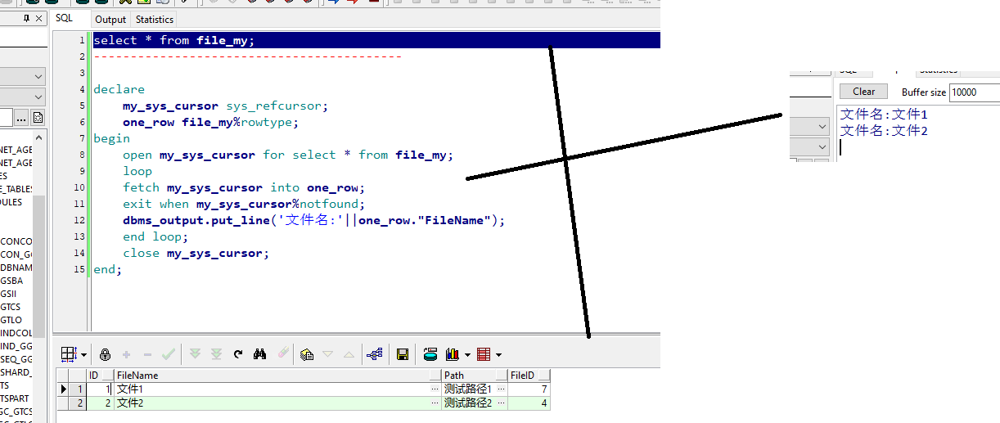
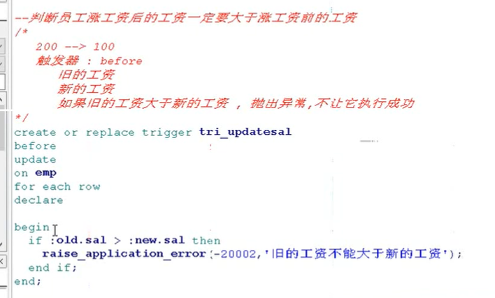

# Oracle
<!-- TOC -->

- [Oracle](#oracle)
  - [基础部分](#基础部分)
    - [创建表空间、创建用户、给用户授权](#创建表空间创建用户给用户授权)
    - [SQL的分类](#sql的分类)
    - [列的类型](#列的类型)
    - [基本操作](#基本操作)
    - [使用子查询的方式创建表](#使用子查询的方式创建表)
    - [使用子查询插入数据](#使用子查询插入数据)
    - [修改表](#修改表)
    - [dual](#dual)
    - [别名](#别名)
    - [四则运算](#四则运算)
    - [条件查询](#条件查询)
    - [排序](#排序)
    - [表的五大约束](#表的五大约束)
      - [单表约束(列级约束)](#单表约束列级约束)
      - [表级约束(外键约束)](#表级约束外键约束)
    - [函数](#函数)
      - [单行函数](#单行函数)
      - [聚合函数(多行函数)](#聚合函数多行函数)
      - [分析函数](#分析函数)
        - [关于rows和range的不同:](#关于rows和range的不同)
    - [条件表达式](#条件表达式)
    - [分组表达式](#分组表达式)
    - [模糊查询](#模糊查询)
      - [转义字符](#转义字符)
    - [多表查询](#多表查询)
      - [笛卡尔积](#笛卡尔积)
      - [内连接](#内连接)
      - [外连接](#外连接)
    - [子查询](#子查询)
      - [exists](#exists)
    - [Oracle使用rowid进行去重](#oracle使用rowid进行去重)
    - [rank()](#rank)
    - [Oracle使用rownum进行分页](#oracle使用rownum进行分页)
    - [集合运算](#集合运算)
      - [并集](#并集)
      - [交集](#交集)
      - [差集](#差集)
      - [注意](#注意)
  - [PLSQL编程](#plsql编程)
    - [游标](#游标)
      - [不带参的普通游标](#不带参的普通游标)
      - [带参数的游标](#带参数的游标)
      - [系统引用游标](#系统引用游标)
      - [使用for循环遍历游标](#使用for循环遍历游标)
    - [异常, 例外:(意外)程序运行的过程发生异常.](#异常-例外意外程序运行的过程发生异常)
      - [自定义异常](#自定义异常)
    - [存储过程](#存储过程)
      - [使用JDBC调用存储过程](#使用jdbc调用存储过程)
      - [merger into用法](#merger-into用法)
    - [存储函数](#存储函数)
    - [触发器](#触发器)
  - [事务](#事务)
  - [视图](#视图)
  - [同义词](#同义词)
  - [序列(sequence)](#序列sequence)
  - [索引](#索引)
    - [索引的原理](#索引的原理)
    - [索引未生效的原因](#索引未生效的原因)
  - [SQL执行计划](#sql执行计划)
    - [方式一: explain plan for](#方式一-explain-plan-for)
      - [操作说明](#操作说明)
        - [一.Table Access...](#一table-access)
        - [二.Nested Loop](#二nested-loop)
    - [方式二: set autotrace on(跟踪性能统计)](#方式二-set-autotrace-on跟踪性能统计)
    - [方式三: statistics_level=all(获取表的访问次数)](#方式三-statistics_levelall获取表的访问次数)
    - [方式四: 通过dbms_xplan.display_cursor输入sql_id参数直接获取](#方式四-通过dbms_xplandisplay_cursor输入sql_id参数直接获取)
    - [方式五: 10046 trace跟踪](#方式五-10046-trace跟踪)
    - [方式六: awrsqrpt.sql工具](#方式六-awrsqrptsql工具)

<!-- /TOC -->
## 基础部分

### 创建表空间、创建用户、给用户授权

**Oracle体系结构:**  
数据库-->数据库实例-->表空间-->数据文件,    创建用户并为用户授予访问表空间的权限.

    --创建表空间, 逻辑单位, 通常我们新建一个项目, 就会去创建表空间, 在表空间中创建用户来创建表.
    --需要管理员权限
    语法:
      create tablespace 表空间名称
      datafile '文件的实际路径'
      size 大小
      autoextend on 自动扩展
      next 每次扩展的大小
    例如:  
      create tablespace file_tablespace
      datafile 'E:\Oracle_DB\product\12.2.0\dbhome_1\oradata\sample\myFile.dbf'
      size 500M
      autoextend on
      next 100M
    --删除表空间, 删除后数据实体文件依然存在, 只是将其从Oracle进程中断开引用, 彻底删除需要亲自去删除文件.
      drop tablespace 表空间名称;
      --如果需要同时删除文件可以使用:
          drop tablespace xxxx including contents and datafiles

    --创建用户, 刚创建的用户无任何权限, 甚至不能登录.
    --格式:  
      create user  用户名
      identified by 密码  
      default tablespace 表空间名称;

      CREATE USER C##USER_X
      IDENTIFIED BY 12345
      ACCOUNT UNLOCK
      DEFAULT TABLESPACE FILE_TABLESPACE;

    --为用户授权
    grant connect,resource to C##USER_X;  --表示把 connect,resource权限授予news用户
    grant dba to C##USER_X;  --表示把 dba权限授予给news用户
      如果需要指定特定的几张表给特定的用户:
      grant select,update,delete,insert on 表 to 用户;
数据库角色权限:  

### SQL的分类

DDL:数据定义语言  

    create alter drop truncate  
DML:数据操纵语言  

    insert update delete
DCL:数据控制语言  

    安全 授权 grant revoke
DQL:数据查询语言

    select
            
### 列的类型

  

    varchar: 在Oracle中, 目前是支持的,  但不保证以后支持.  
    varchar2(长度): 可变字符长度 varchar2(10)   hello  占用5个字符  
    char(长度): 可变字符长度 char(10)   hello  占用10个字符, 用空格填充其他空位  
    number(总长度,小数长度): 数字类型 例如: number(12,3)
    --注意: number小数位数不能大于等于总长度  
    date: 年月日时分秒  select current_date from dual;  
    timestamp: 时间戳, 比date类型更加精确   select current_timestamp from dual;

### 基本操作

增:  

    insert into 表名(表字段) values(...);表名后不加括号表示全添加,一次添加多条数据时,使用逗号分隔.
删:

    delete from 表名 where 条件
    --delete 和 truncate 区别:
    --delete 属于DML, 逐条删除, 支持事务操作;
    --truncate 属于DDL, 先删除表再创建表, 不支持事务操作;
改:  

    update 表名 set 表字段=... where 条件
查:  

    select * from 表名;
    --查看数据库中所有的表
    select * from all_tables

### 使用子查询的方式创建表

create table 表名 as 查询语句  
**注意:**  

    1. 该方式只会复制表结构和表数据, 不会复制表中列的约束
    2. 如果查询语句有结果会复制表结构和数据, 否则只会复制表结构

### 使用子查询插入数据

**语法:**  

    insert into 表名 查询语句
    --例如:
    insert into emp2 select * from emp1;

### 修改表

添加列  

    alter talbe 表名 add 列名 列类型;
    alter talbe 表名 add (列名1 列类型,列名2 列类型);
修改列类型  

    alter table 表名 modify 列名 列类型;
修改列名

    alter table 表名 rename column 原列名 to 新列名;
删除列  

    alter table 表名 drop column 列名
修改表名

    rename 旧名 to 新名
删除表

    drop table 表;

### dual

虚表, 伪表用于补齐语法结构  

    select 1+1;-- 在oracle中会报错, 但在mysql中正常输出2.  

    select 1+1 from dual; -- oracle

### 别名

1. 给表起别名  
（1）表的别名要在from子句中指定，并且别名位于查询中其余列之前  
（2）使用表的别名可以减少查询中输入的文本的数量，并且可能还会减少在输入过程中的错误。  
2. 给字段起别名  
（1）使用AS 在该字段后面空一格，使用AS 空格 别名，这种方式来起别名给字段  
（2）直接在字段的后面空格，然后再起别名也是可以的
3. 别名中不能存在特殊字符或者关键字, 如果有需要使用引号.  

**注意:**
双引号主要是别名, 单引号是使用的值,是字符串.

### 四则运算

null值, 代表不确定 不可预知, 不能进行四则运算;  
使用函数nvl(xxxx,0)处理空值, 在mysql中ifnull函数,与此类似.  

### 条件查询

where后面的写法  
关系运算符:  

    > >= = < <= != <>
逻辑运算符:  

    and or not  
其他运算符:  

    like 模糊查询  
    in 在某个集合内     
    between...and 在某个区间内  
    is null 判断为空
    is not null 判断不为空  

### 排序

select * from emp order by comm desc nulls last

    nulls first -- null排序完成后放在前面
    nulls last -- null排序完成后放在后面  
    order by 字段1 asc,字段2 desc --实现复合排序

### 表的五大约束

用来约束表中数据的规则.

#### 单表约束(列级约束)

  1. not null 非空  
  如果在列上定义了not null 那么当插入数据时 ，必须为列提供数据.  
  2. unique 唯一  
  当定义了唯一约束后，该列值不能重复， 但是可以为null (可以出现多个null)  
  3. primary 主键  
  用于唯一的标识表中一行的数据，当定义主键约束后，该列不但不可以重复而且不能为null。  
  主键包含了not null 和unique.  
  一张表最多可以有一个主键，但是可以有多个unique 约束  
  4. check 检查 判读  
  用于强制行数据必须满足的条件，假定在sal 列上定义了check 约束，并要求sal列值在1000——2000 之
  间，如果不在1000——2000之间，就会提示报错。(检查约束在MySQL中写将会被忽略)  
  

**后续追加:**  

    --未指定名称oracle将会自动命名
    alter table 表名
    add constraint 约束名 约束类型(列名或检查条件);

**移除约束:**  

    alter table 表名
    drop constraint 约束名;
    移除非空约束(一般不需要删除)：
    alter table table_name
    modify column_name null;

#### 表级约束(外键约束)

    foreign key 外键  
    用于定义表和表之间的关系，外键约束要定义在从表上，主表则必须具有主键约束或是unique 约束，当定义外键约束后，要求外键列数据必须在主表的主键存在或是为null.  

**添加外键约束:**  

    alter table 从表 add foreign key(从表列) referrences 主表(主表列)
    --如果主从表已经存在违背外键的数据, 键无法创建

**强制删除:**

    drop table 表名 cascade constraint;  
[相关链接](https://blog.csdn.net/a327736051/article/details/48766127)  

注意:  
**设置enable|disable可以无视从表是否已删除关联数据, 直接删除主表数据,但不能删除主表, 且重新enable外键会由于数据违背而启用失败**

**级联删除:**  
首先去从表中找有没有关联数据, 找到了先删除从表的, 后删除主表中的关联数据  

    --允许外键使用级联删除
    alter table 主表 add foreign key(主表列) references 从表(从表列) delete cascade;
**级联更新:**  
[Oracle使用设置延迟约束并结合触发器实现级联更新](https://www.2cto.com/database/201507/417496.html)

### 函数

[oracle函数大全](https://blog.csdn.net/ruiguang21/article/details/80049578)  

#### 单行函数

对某一行中的某一个值进行处理

    数值函数  
      ---------------------------
      select ceil(45.926) from dual; --46
      select ceil(45.111) from dual; --46
      select floor(45.926) from dual; --45
      select round(45.926,3) from dual; --保留两位小数, 45.93
      select round(45.926,-1) from dual; --50
      ------------截断---------------
      select trunc(45.926,2) from dual; --直接截断保留2位小数, 不会四舍五入, 45.92
      select trunc(45.926,-1) from dual; --40
      select trunc(45.926,-2) from dual; --0
      ------------求余---------------
      select mod(9,3) from dual; --0
    字符函数
      substr(str1,起始索引,长度)
      select substr('abcdefgh',3,2) from dual; -- cd
      select substr('abcdefg',0,3) from dual; -- abc
      select substr('abcdefg',1,3) from dual; -- 结果同上， 是的你没看错
      -- 注意：起始索引不管是从0还是1, 都是从第一个字符开始截取.  
      ----------------------------------
      --获取字符串的长度
      select length('abcdefghijklmnopqrstuvwxyz') from dual; -- 26
      ----------------------------------
      --去除字符串左右两边的空格
      select trim('    hello    ') from dual; --并不是什么空格都能够去除，全角的空格不能去除.
      select replace('hello','l','a')  from dual;-- heaao
    日期函数
      select sysdate from dual; -- 查询系统时间
      --查询三个月后的今天
      select add_months(sysdate,3) from dual;
      --查询三天后的时间
      select sysdate+3 from dual;
      -- 需要注意的是sysdate查询的是服务器时间, 就是数据库所在的机器的时间.
      --查询员工入职的天数
      select sysdate-hiredate from emp;
      select ceil(sysdate-horedate) from emp; --向上取整的天数
      -- 两个时间之间的的月数
      select months_between(sysdate,sysdate-100) from dual；
    转换函数
      --字符转数值 to_number(str) 鸡肋
      select 100+'10' from dual; --110 默认已经帮我们转化了
      select 100+to_number('10') from dual;
      --数值转字符
      select to_char(1800,'$9,999.99')from dual; --$1,800.00
      select to_char(1800,'L9,999,99')from dual; --￥1,800.00
      --日期转字符
      select to_char(sysdate,'yyyy-mm-dd hh:mi:ss') from dual;

      select to_char(sysdate,'d') from dual;--代表一周中的第几天
      select to_char(sysdate,'dd')from dual;--代表一个月中的第几天
      select to_char(sysdate,'ddd')from dual;--代表一年中的第几天
      select to_char(sysdate,'day') from dual;--星期几

      --字符转日期
      select to_date('20190819','yyyy:mm:dd')from dual;--2018/08/19 无论第二个参数的符号是什么都转化为通用的日期格式.  
  

  通用函数
    nvl(参数1,参数2)     如果参数1为null, 就返回参数2
    nvl2(参数1,参数2,参数3)     如果参数1=null,   返回参数3, 否则返回参数2  
    nullif(参数1,参数2)   当参数1=参数2, 返回null,  否则返回参数1  
    --coalesce: 返回第一个不为null 的函数
    select coalesce(null,1,null,5) from dual;

#### 聚合函数(多行函数)

对某一列中的所有行进行处理  

    sum() count() max() min() avg()

1. 直接忽略空值
2. 对于avg()这样的函数, 在进行平均计算时, 将直接忽视空值, 最终除数是非空的那几列, 可能不是我们想要的结果, 使用avg(nvl(xxx,0))或者使用sum()/count()这样的组合可以解决.  

比较复杂的聚合函数: listagg()
listagg(列,'分隔符') within group (order by 排序字段) 可以将字段按顺序拼接成一行,以指定的分隔符分割.  
例如:
  
  select deptno,listagg(ename,',')within group(order by sal)name from emp group by deptno;  
  
也可以进行分析函数联合,

  select deptno,ename,sal,listagg(ename,',')within group(order by sal)over(partition by deptno)name from emp;  

#### 分析函数

该分析函数可以进行分组排序，group by分组后会把同一组的融合，但分析函数不会把同一组的融合, 每一行都有一个统计值.

相关链接1: <https://www.cnblogs.com/linjiqin/archive/2012/04/04/2431975.html>  
相关链接2: <https://mrbird.cc/oracle%20Window%20function.html>  
语法:

>分析函数带有一个开窗函数over()，包含三个分析子句:分组(partition by), 排序(order by), 窗口(rows/range) ，它们的使用形式如下：

    over(partition by xxx order by yyy rows/range between ..........)
    --这里的rows/range, 如不需要, 可以省略.
    --over() 前面可以接聚合函数(sum、max、min、count、avg)或者行比较函数(lead、lag), over开窗将通知系统不能将它们当作普通的聚合函数或者行比较处理.  

对语法的另一种解释:

    --分析函数由三个部分组成：分区子句、排序子句和开窗子句
    function(arg1,arg2,...argN)
    over([partition-by-clause] [order-by-clause] [windowing-clause])

over前的函数除了聚合函数可以用之外, 还可使用:  

|函数|说明|
|---|---|
|FIRST_VALUE|取出分组内排序后，截止到当前行，第一个值|
|LAST_VALUE|取出分组内排序后，截止到当前行，最后一个值|
|LEAD(col,n,DEFAULT)|用于统计窗口内往下第n行的值。第一个参数为列名，第二个参数为往下第n行(可选，默认为1)，第三个参数为默认值(当往下第n行为NULL时，取默认值)|
|LAG(col,n,DEFAULT)|与lead相反，用于统计窗口内往上第n个值。第一个参数为列名，第二个参数为往上第n行(可选，默认为1)|

窗口子句:

    unbounded preceding表示以分组数据的第一行最为上边界；
    unbounded following表示以分组数据的最后一行最为下边界；
    current row表示当前数据行；
    n preceding表示当前数据行的前n 行；
    n following表示当前数据行的后n 行。

1、窗口子句必须和order by 子句同时使用，且如果指定了order by 子句未指定窗口子句，则默认为RANGE BETWEEN unbounded preceding AND CURRENT ROW.
2、如果分析函数没有指定ORDER BY子句，也就不存在ROWS/RANGE窗口的计算；
**注：行比较分析函数lead和lag无window(窗口)子句。**

##### 关于rows和range的不同:

使用下面的SQL:

    SELECT
        id,
        SUM(ID) OVER(ORDER BY ID) AS default_sum,
        SUM(ID) OVER(ORDER BY IDRANGE BETWEEN unbounded preceding AND CURRENT ROW) AS range_ub_sum,
        SUM(ID) OVER(ORDER BY ID ROWS BETWEEN unbounded preceding AND CURRENT ROW) AS rows_ub_sum,
        SUM(ID) OVER(ORDER BY ID RANGE BETWEEN 1 preceding AND 2 following) AS range_sum,
        SUM(ID) OVER(ORDER BY ID ROWS BETWEEN 1 preceding AND 2 following) AS rows_sum
    FROM t

结果如下:

|ID|DEFAULT_SUM|RANGE_UB_SUM|ROWS_UB_SUM|RANGE_SUM|ROWS_SUM|
|---|---|---|---|---|---|
|1|2|2|1|5|5|
|1|2|2|2|5|11|
|3|5|5|5|3|16|
|6|23|23|11|33|21|
|6|23|23|17|33|25|
|6|23|23|23|33|27|
|7|30|30|30|42|30|
|8|38|38|38|24|24|

**1. rows方式**
>rows是物理窗口，即根据order by 子句排序后，取的前N行及后N行的数据计算（与当前行的值无关，只与排序后的行号相关）
如果是上面的例子, ROWS_SUM取当前行的前一行到后俩行共四行的数据, 进行操作.

**2. range方式**
>range是逻辑窗口，是指定当前行对应值的范围取值，列数不固定，只要行值在范围内，对应列都包含在内.
如果是上面的例子, RANGE_SUM取的范围, 与当前行的值(此处是id)有关, 这里是指取比当前id小1大2的行, 当然以实际命中为准, 比如id=3这一行, 得到的结果为3,就是因为它要取id在2到5之间的, 就只能取到3导致的.

### 条件表达式

    case 字段
      when 值1   then 值
      when 值2   then 值
      else 默认值  
    end
    --MySQL和Oracle都有该功能

相关链接:  
<https://www.cnblogs.com/gss0525/p/6784338.html>
<https://blog.csdn.net/wangshfa/article/details/21375613>

  --Oracle特有的写法
  decode(字段, if1, 值1, if2, 值2, else值)  

### 分组表达式

格式:

  select 分组的条件,分组之后的操作 from 表名 group by 分组的条件 having 条件过滤

----------

  --分组总计所有部门的平均工资, 选出超过1000的
  select deptnum,avg(sal) from emp group by deptnum having avg(sal)>1000
  --如果使用别名将出错
  select deptnum,avg(sal) dd from emp group by deptnum having dd>1000

----------

  SQL的编写顺序:
    select ...from....where...group by ...having...order by ...
  SQL的执行顺序
    from...where...group by... having...select...order by...
  where和having区别:
    where后面不能接聚合函数, 可以接单行函数
    having是在group by之后执行, 可以接聚合函数

### 模糊查询
左右模糊查询（INSTR相比LIKE效率高）：  

  INSTR(column_name,value) > 0 或 LIKE '%value%'  
  INSTR(column_name,value) = 0 或 NO LIKE '%value%'
Mybatis中：  

  like '%' || UPPER(#{model.desLike}) || '%'
  UPPER()大写转换
拼接也可使用CONCAT, 但是由于CONCAT(param1，param2)只有两个参数,多次拼接需要嵌套.  
<https://www.cnblogs.com/kangkaii/p/8421837.html>  

#### 转义字符
使用 `q'[]'` ,中括号中的字符会被转义处理

  select q'[']' from dual; 

### 多表查询

#### 笛卡尔积
两张表的乘积.  

**格式:** select * from table1,table2

#### 内连接
**隐式内连接:**

  等值内连接:  例如:  where table1.id=table2.id  
  不等值内连接:  例如:  where table1.id<>table2.id  
  自连接:  自己表关联自己 select * from table1 t1 ,table1 t2

**显示内连接:**

  select * from 表1 inner join 表2 on 连接条件
  inner 关键字可以省略

#### 外连接
左外连接: left outer join    
右外连接: right outer join
outer 可以省略

  Oracle中的外连接:
  例如:  
  左外连接, 当右表关联条件没有与之对应的值使用空值与之对应.  
  select * from emp e1,dept d1 where e1.deptno=d1.deptno(+);
  使用(+)表示添加null值对应.  

### 子查询
查询语句中嵌套查询语句; 用来解决复杂的查询语句.  
**单行子查询:** 子句只有一个值,可以使用> >= < <= !=  
**多行子查询:** 使用in, not in, any, all, exists 需要注意的是子查询的结果集中如果存在null, 通常需要将null去除, 另外, 当一个字段设置为一定长度, 比如char(100), 即使是null也是占用100的空间.  

  例如: select * from emp where empno not in (select mgr from emp where mgr is not null)

  又例如:  
  select * from file_my where "FileName"  in ('文件1',null)
  用in可以显示,但是少了一条null的数据, 但是用not in, 就不会显示任何一条数据, 这个原因是因为

#### exists

使用exists可以在数据量较大的时候提高效率.

  用法一:  

    select * from emp where exists (select * from emp where empno=112);表中没有112这个记录时,条件由于恒等于false不会查到任何记录

    select * from emp where exists (select * from emp where empno=11);表中有11这个记录时,条件由于恒等于true会查到所有记录

  用法二:

    --查询有员工的部门
    select * from dept d1 where exists (select * from emp e1 where e1.deptno=d1.deptno)
  

### Oracle使用rowid进行去重

  

### rank()

<http://www.cnblogs.com/wuyisky/archive/2010/02/24/oracle_rank.html>  
[Oracle中row_number()、rank（）、dense_rank()的区别](https://www.cnblogs.com/qiuting/p/7880500.html)  

### Oracle使用rownum进行分页
伪列：rownum,系统自动生成, 表示行号, 起始值为1, 查到结果后再添加1    

  注意: select rownum,"FileName" from file_my where rownum>2  --无任何记录
       

  select rownum from table1   
rownum前面加不了表的前缀   

  select name from(select name,rownum rm from table1) where rm<10 and rm>3
如果要限定范围查询需要使用子查询，无法使用rownum直接进行范围限定，rownum<10 and rownum>3是不能查询出正确的结果，需要使用别名  
**原因:**  
[ORACLE——ROWNUM解析（使用ROWNUM大于条件，无法得到任何查询结果）](https://blog.csdn.net/jQuerys/article/details/52432770)  
关于分页：<https://www.cnblogs.com/zhaotiancheng/p/6262635.html>  

### 集合运算

#### 并集

将两个查询结果进行合并.  
union和union all  
<https://www.cnblogs.com/macavalier/p/3154269.html>

#### 交集

  

#### 差集

[minus关键字](https://www.1keydata.com/cn/sql/sql-minus.php)

#### 注意

  1. 运算时两结果集的列数需要一致, 空的列需要用null补齐, 不能3列对2列
  2. 列的数据类型需要一致

## PLSQL编程
过程语言, 编写一些复杂业务逻辑.  

    --输出菱形
      abs(x)+abs(y)<=m

--------------------------

    declare
      m number:=3;
    begin
      for y in -m..m loop
        for x in -m..m loop
          if abs(x)+abs(y)<=m then
            dbms_output.put('*');
          else
            dbms_output.put(' ');
          end if;
        end loop;
        dbms_output.new_line();
      end loop;
    end;
    

* 引用型变量

    --例如 定义一个与员工表中sal(工资)类型相同的变量
    vsal emp.sal%type

* 记录型变量

    row emp%rowtype

### 游标

用来操作查询的结果集, 相当于JDBC中的ResultSet.

#### 不带参的普通游标

语法:  

  cursor 游标名 is 查询结果集

开发步骤:  

  1. 声明游标
  2. 打开游标    open 游标名称
  3. 从游标中取数  fetch 游标名 into 变量
    游标名%found: 找到数据
    游标名%notfound: 没有找到数据
  4. 关闭游标   close 游标名
  

#### 带参数的游标

声明游标时声明参数, 在打开游标时输入参数.  
  

#### 系统引用游标

开发步骤:  

  1. 声明游标 : 游标名  sys_refcursor
  2. 打开游标  open 游标名 for 结果集
  3. 从游标中取数据
  4. 关闭游标
  

#### 使用for循环遍历游标

for循环遍历游标:  

  1. 不需要声明额外的变量
  2. 不需要打开游标
  3. 不需要关闭游标

例如:  

    declare
        cursor my_cursor is select * from file_my;
    begin
        for one_row in my_cursor loop
            dbms_output.put_line('文件名:'||one_row."FileName");
        end loop;
    end;

### 异常, 例外:(意外)程序运行的过程发生异常.

  declare
    --声明变量
  begin
    --业务逻辑
  exception
    --处理异常
    when 异常1 then
         ........
    when 异常2 then
    ........
    when others then
    --处理其他异常
  end;

zero_divide :除零异常  
value_error :类型转换异常  
too_many_rows :查询出多行记录,赋值给只能保存一行记录的变量  
no_data_found :没有找到数据  
  

#### 自定义异常

  

### 存储过程  

相关链接:  
<https://blog.csdn.net/qq_37057095/article/details/76669489>  
<https://www.cnblogs.com/taiguyiba/p/7809310.html>
封装在服务器上的一段PLSQL代码片断, 已经编译完成.  

  1. 客户端调用存储过程, 执行效率较高.  
  2. 格式
    create (or replace) procedure 存储过程的名称(参数名 in|out 参数类型, 参数名 in|out 参数类型)
    is | as
    --声明部分
    begin
    --业务逻辑
    end;
  

#### 使用JDBC调用存储过程

JDBC的开发步骤:

  1. 导入驱动包
  2. 注册驱动
  3. 获取链接
  4. 获取执行SQL的statement
  5. 封装参数
  6. 执行SQL
  7. 获取结果
  8. 释放资源

#### merger into用法

  merger into A using B on (比较语句)
  when matched then
    update 语句
  when not matched then
    insert 语句
比较A和B, 是否符合on中的条件, 如果满足条件则update, 否则insert.
这里的update和insert是经过简化的语句.
例如:  

  MERGE INTO A_MERGE A USING (select B.AID,B.NAME,B.YEAR from B_MERGE B) C ON (A.id=C.AID)
  WHEN MATCHED THEN
  UPDATE SET A.YEAR=C.YEAR 
  WHEN NOT MATCHED THEN
  INSERT(A.ID,A.NAME,A.YEAR) VALUES(C.AID,C.NAME,C.YEAR);
  commit;
可以加where条件:  

  merge into A_MERGE A USING (select B.AID,B.name,B.year,B.city from B_MERGE B) C 
  ON(A.id=C.AID) 
  when matched then
  update SET A.name=C.name where C.city != '江西'
  when not matched then
  insert(A.ID,A.name,A.year) values(c.AID,C.name,C.year) where C.city='江西';
  commit;

### 存储函数

一段封装在Oracle服务器的一段PLSQL代码片断  

**语法:**

  create [or replace] function 存储函数的名称(参数名 in|out 参数类型)
  return 参数类型
  is | as
  begin
  end;
**存储过程和存储函数的区别:**

  1. 本质上没有区别
  2. 函数存在的意义是给过程调用 存储过程调用存储函数.
  3. 函数可以在sql中直接调用, 存储过程不能.
  4. 存储过程可以实现的存储函数也可以实现, 反之亦然.

例:  

  --查询指定员工的年薪
  --参数: 员工的编号    返回: 年薪
  create or replace function func_getsal(vempno number) return number
  is
    --声明变量, 保存年薪
    vtotalsal number;
  begin
    select sal*2+nvl(comm,0) into vtotalsal from emp where empno=vempno;  
    return  vtotalsal;
  end;

  --调用
  declare
    vsal number;
  begin
    vsal:=func_getsal(123);
    dbms_output.put_line(vsal);
  end;

  --调用
  select ename,func_getsal(empno) from emp;

### 触发器

当用户执行了insert | update | delete这些操作后,可以触发一系列其他动作.  

**作用:**  
在动作执行之前或者之后, 触发业务处理逻辑.

**语法:**  

  create [or replace] trigger 触发器名称
  before | after
  insert | update | delete
  on 表名
  [for each row]
  declare
  begin
  end;

  

**触发器的分类:**  

  1. 语句级触发器, 也叫表级触发器, 无论语句影响多少行只会触发一次
  2. 行级触发器, 影响几行触发几次
    行级触发器可以使用 :new  新纪录   :old   操作前的旧记录

使用行级触发器可以实现将null值插入主键时,自动填充相应的值.  

## 事务

一组操作需要同时成功或者同时失败.  
**特性:**  

  原子性, 隔离性, 持久性, 一致性
如果不考虑隔离级别: 脏读, 幻读, 不可重复读  
**MySQL隔离级别:**  

  READ UNCOMMITTED: 允许事务读取未被其他事务提交的变更.  
  READ COMMITTED: 只允许事务读取其他事务已经提交的变更.  
  REPEATABLE READ: 确保事务可以多次从一个字段中获取相同的值, 在整个事务持续期间, 禁止其他事务对这个字段进行修改.  
  SERIALIAZABLE:  确保事务可以从一个表中读取相同的行, 在整个事务持续期间, 禁止其他事务对该表执行插入、更新和删除操作.
**Oracle隔离级别:**  

  READ COMMITTED, SERIALIZABLE, READ ONLY.
  默认的隔离级别: READ COMMITTED
[数据库事务隔离级别-- 脏读、幻读、不可重复读](https://blog.csdn.net/jiesa/article/details/51317164)

**提交:**  

  commit
**事务的保存点/回滚点:**  

  savepoint 保存点的名称
**回滚:**

  rollback 或者 rollback to 保存点
  

## 视图

对查询结果的一个封装,视图中所有的数据都来自于源表, 视图本身不存储任何数据

  1. 能够封装复杂的查询结果
  2. 屏蔽表中的细节
**语法:**  

  create or replace view 视图名 as 查询语句 [with read only]
**注意:**  

  通常不要通过视图修改数据, 视图创建时, 通常要加上with read only  

## 同义词

  create [public] synonym 同义词名 for 表或视图(可以是db link的表)

## 序列(sequence)

序列（Sequence），又叫序列生成器，用于提供一系列的数字，开发人员使用序列生成唯一键。每次访问序列，序列按照一定的规律增加或者减少。  
序列的定义存储在SYSTEM表空间中，序列不像表，它不会占用磁盘空间。  
序列独立于事务，每次事务的提交和回滚都不会影响序列。  
MySQL使用的是auto_increment.

  创建序列
    create sequence 序列名称
    start with 从几开始
    increment by 步长,每次增长多少
    maxvalue 最大值 | nomaxvalue
    minvalue 最小值 | nominvalue
    cycle | nocycle 是否循环
    cache 缓存的数量 | nocache
  例如:
    create sequence seq1
    start with 1
    increment by 2
    maxvalue 30
    cycle
    cache 10;
  使用最多的写法:
    create sequence 序列名称; --无最大值,从1开始,每次增长1, 不循环, 不缓存
  使用序列值:
    sequence名.currval  --当前值
    sequence名.nextval --下一个值
**注意:** currval需要在调用一次nextval之后才能使用

## 索引

<https://www.cnblogs.com/tianmingt/articles/4444885.html>  
**语法:**  

  create index 索引的名称 on 表名(列)
**注意:**
主键约束自带主键索引, 唯一约束自带唯一索引  
  
  
SQL优化的索引策略:  

  1. F5调用explain 查看计划
  2. cost CPU调用次数
  3. Cardinality 影响行数

### 索引的原理

btree  (balance Tree) 平衡二叉树

### 索引未生效的原因

<https://www.cnblogs.com/gaoyuechen/p/8058246.html>

## SQL执行计划

使用情景:  

  1.当某一条SQL执行速度缓慢, 可以使用方式一或者四;
  2.跟踪某条SQL最简单的是方法一,其次是方法二;
  3.如果想要观察某条或者多条SQL的执行情况, 只能使用方法四和方法六;
  4.如果SQL含有多函数, 函数中存在SQL嵌套, 多层递归调用, 想准确分析, 只能使用方法五;
  5.要想确保看到真实的执行计划, 不能使用方法一和二;
  6.想要获取表被访问的次数, 只能使用方法三;

### 方式一: explain plan for

    步骤1:explain plan for 你的SQL
    步骤2:select * from table(dbms_xplan.display());
如果使用PLSQL, 可以按F5查看.
  

  

  

    id：为每个操作的唯一序列号
    operation：为每个操作的名称和方式
    name：是操作对象
    Rows：Oracle估算当前操作影响的行数
    bytes：Oracle估算当前操作的影响的数据量（单位byte）
    Cost：Oracle计算出来的执行该操作的代价
    Time：Oracle估算出来的该操作花费的时间
按照显示的逻辑: 并列的操作从上向下执行, 靠右的操作优先于靠左的操作.

对于操作Id前面带*号的,表示带有谓语条件(访问条件Access或者过滤条件Filter).

#### 操作说明

##### 一.Table Access...

$$Table\;Access ...(表访问):\left\{
\begin{aligned}
&1.Table\;Access\;Full\;(全表扫描)&\\
&2.Table\;Access\;By\;Index\;RowId\;(通过RowId查找)&\\
&3.Table\;Access\;By\;Index\;Scan\;(索引扫描)&\\
\end{aligned}
\right.
$$
1. 全表扫描:读取表中所有的行，并检查每一行是否满足SQL语句中的 Where 限制条件.
2. RowId的表存取: 通过RowId可以定位数据所在的数据文件、数据块、以及在数据块中的位置.
3. 索引扫描: 在索引块中存储索引值和RowId, 索引的概念结构可以如下理解,
  
所以,索引扫描分为两步,
Ⅰ：扫描索引得到对应的ROWID
Ⅱ：通过ROWID定位到具体的行读取数据
$$索引扫描:\left\{
\begin{aligned}
&1.Index\;Unique\;Scan&(唯一索引)\\
&2.Index\;Range\;Scan&(范围索引)\\
&3.Index\;Fast\;Scan&(快速索引)\\
&4.Index\;Full\;Scan&(全索引)\\
&5.Index\;Skip\;Scan&(跳跃索引)\\
\end{aligned}
\right.
$$

**唯一索引扫描**: 每次至多返回一条数据, 对于唯一性约束或者主键经常会使用该策略.

**范围索引扫描**: 发生范围扫描的情况,

>1. 对唯一索引使用`<`,`>`,`>=`,`<=`,`<>`,between
>2. 在组合索引上,只使用部分列(查询时使用前导列,否则走全表扫描)
>3. 对非唯一索引列上进行的任何查询

**快速索引扫描**: 扫描索引中的所有的数据块，与Index Full Scan类似，但是一个显著的区别是它不对查询出的数据进行排序（即数据不是以排序顺序被返回）.

**全索引扫描**: 进行全索引扫描时,查询的数据必须从索引中可以直接得到,(全索引扫描只有在CBO模式下会生效).

[RBO和CBO概念](./RBO和CBO.md)

**跳跃索引扫描**: 复合索引的前导列（索引包含的第一列）没有在查询语句中出现，oralce也可能会使用该复合索引，这时候使用Index Skip Scan;

  什么时候会触发 INDEX SKIP SCAN 呢？

  前提条件：表有一个复合索引，且在查询时有除了前导列（索引中第一列）外的其他列作为条件，并且优化器模式为CBO时.
  当Oracle发现前导列的唯一值个数很少时，会将每个唯一值都作为常规扫描的入口，在此基础上做一次查找，最后合并这些查询；

  例如：
  假设表emp有ename（雇员名称）、job（职位名）、sex（性别）三个字段，并且建立了如 create index idx_emp on emp (sex, ename, job) 的复合索引；
  因为性别只有 '男' 和 '女' 两个值，所以为了提高索引的利用率，Oracle可将这个复合索引拆成 ('男', ename, job)，('女', ename, job) 这两个复合索引；
  当查询 select * from emp where job = 'Programmer' 时，该查询发出后：
  Oracle先进入sex为'男'的入口，这时候使用到了 ('男', ename, job) 这条复合索引，查找 job = 'Programmer' 的条目；
  再进入sex为'女'的入口，这时候使用到了 ('女', ename, job) 这条复合索引，查找 job = 'Programmer' 的条目；
  最后合并查询到的来自两个入口的结果集。

##### 二.Nested Loop
循环嵌套, 描述的是表连接方式.  
[表连接方式](./表连接方式.md)

方式一, 优点: 无需真正的执行
缺点:没有输出运行时的相关统计信息(产生多少逻辑读,多少次递归调用,多少次物理读等),无法判断处理了多少行,无法判断表被访问了多少次.

### 方式二: set autotrace on(跟踪性能统计)
需要在SqlPlus执行.
在sqlplus中,

set autotrace on (得到执行计划,输出运行结果)
set autotrace traceonly (得到执行计划, 不输出运行结果)
set autotrace traceonly explain (得到执行计划,不输出运行结果和统计信息部分, 仅展现执行计划部分)
set autotrace traceonl statistics (不输出运行结果和执行计划部分,仅展现统计信息部分)

方式二,优点:可以看到统计信息(产生的逻辑读,多少次递归调用,多少次物理读等)
缺点:必须等到执行完毕后,才能出结果, 不显示表被访问了多少次.

**统计信息解释:**
recursive calls 递归调用
db block gets 从buffer cache中读取block的数量,用于 insert,delete,update,select for update.
consistent gets 从buffer cache中读取undo数据的block的数量,用于查询(除去select for update)的block数量
physical reads 从磁盘读取的block数量
redo size DML生成的redo的大小
sorts (memory) 在内存执行的排序量
sorts (disk) 在磁盘上执行的排序量

整个逻辑读=(db block gets)+(consistent gets)
[undo和redo](./undo和redo.md)  

### 方式三: statistics_level=all(获取表的访问次数)
推荐使用sqlplus, 否则可能信息不全.
步骤1: alter session set statistics_level=all ;
步骤2: 在此处执行你的SQL
步骤3: select * from table(dbms_xplan.display_cursor(null,null,'allstats last'));
解读:  

  1. Starts为该sql执行的次数。
  2. E-Rows为执行计划预计的行数。
  3. A-Rows为实际返回的行数。A-Rows跟E-Rows做比较，就可以确定哪一步执行计划出了问题。
  4. A-Time为每一步实际执行的时间（HH：MM：SS.FF），根据这一行可以知道该sql耗时在了哪个地方。
  5. Buffers为每一步实际执行的逻辑读或一致性读。
  6. Reads为物理读。
  7. OMem:当前操作完成所有内存工作区(Work Aera)操作所总共使用私有内存(PGA)中工作区的大小，这个数据是由优化器统计数据以及前一次执行的性能数据估算得出的
  8. 1Mem:当工作区大小无法满足操作所需的大小时，需要将部分数据写入临时磁盘空间中(如果仅需要写入一次就可以完成 操作，就称一次通过，One-Pass;否则为多次通过，Multi_Pass).该列数据为语句最后一次执行中，单次写磁盘所需要的内存大小，这个由优化器统计数据以及前一次执行的性能数据估算得出的。
  9. User-Mem:语句最后一次执行中，当前操作所使用的内存工作区大小，括号里面为(发生磁盘交换的次数,1次即为One-   Pass,大于1次则为Multi_Pass,如果没有使用磁盘，则显示OPTIMAL)
  10. OMem、1Mem为执行所需的内存评估值，0Mem为最优执行模式所需内存的评估值，1Mem为one-pass模式所需内存的评估值。
  11. 0/1/M 为最优/one-pass/multipass执行的次数。Used-Mem耗的内存

优点:

1. 可以清晰的从STARTS得出表被访问多少（因为表的访问开销是很大的，这是很重要的一点）。
2. 可以清晰的从E-ROWS和A-ROWS中得到预测的行数和真实的行数，从而可以准确判断Oracle评估是否准确（很重要的一点）。
3. 虽然没有专门的输出运行时的相关统计信息，但是执行计划中的BUFFERS就是真实的逻辑读的多少          

缺陷:
1. 必须要等到语句真正执行完毕后，才可以出结果。
2. 无法控制记录输屏打出，不像autotrace有 traceonly 可以控制不将结果打屏输出。
3. 看不出递归调用的次数，看不出物理读的多少（不过逻辑读才是重点）

### 方式四: 通过dbms_xplan.display_cursor输入sql_id参数直接获取
步骤： select  * from table(dbms_xplan.display_cursor('sql_id')); （该方法是从共享池里得到）  

SQL_ID可以通过:  

  select * from v$sql;
  
注：
1. 还有一个方法，select  * from table(dbms_xplan.display_awr('sql_id'));（这是awr性能视图里获取到的）
2. 如果有多执行计划，可以用类似方法查出（0、1、2...）
select * from table(dbms_xplan.display_cursor('cyzznbykb509s',0));
select * from table(dbms_xplan.display_cursor('cyzznbykb509s',1));

优点: 
1. 知道sql_id立即可得到执行计划，和explain plan for 一样无需执行；
2. 可以得到真实的执行计划。（停，等等，啥真实的，刚才这几个套路中，还有假的执行计划的吗？)

缺陷:
1. 没有输出运行时的相关统计信息（产生多少逻辑读，多少次递归调用，多少次物理读的情况）；
2. 无法判断是处理了多少行；  
3. 无法判断表被访问了多少次。

### 方式五: 10046 trace跟踪
在sqlplus中执行,
步骤1: alter session set events '10046 trace name context  forever,level 12'; （开启跟踪）
步骤2: 执行你的语句
步骤3: alter session set events '10046 trace name context off';   （关闭跟踪）
步骤4: 找到跟踪后产生的文件
步骤5: tkprof  trc文件  目标文件（没有目标文件会弹出打开窗口）  sys=no sort=prsela,exeela,fchela  （格式化命令）

如果需要找到跟踪文件, 可以使用:  

  select d.value
  || '\'
  || LOWER (RTRIM(i.INSTANCE, CHR(0)))
  || '_ora_'
  || p.spid
  || '.trc' trace_file_name
  from (select p.spid
    from v$mystat m,v$session s, v$process p
    where  m.statistic#=1 and s.sid=m.sid and p.addr=s.paddr) p,
    (select t.INSTANCE
    FROM v$thread t,v$parameter v
    WHERE v.name='thread'
    AND(v.VALUE=0 OR t.thread#=to_number(v.value))) i,
    (select value
    from v$parameter
    where name='user_dump_dest') d;

  

格式化文件,并输出到指定位置:    
  
然后在D://1.txt就能看到.

优点:
1. 可以看出SQL语句对应的等待事件
2. 如果SQL语句中有函数调用，SQL中有SQL，将会都被列出，无处遁形。
3. 可以方便的看出处理的行数，产生的物理逻辑读。
4. 可以方便的看出解析时间和执行时间。
5. 可以跟踪整个程序包

缺陷:
1. 步骤繁琐，比较麻烦
2. 无法判断表被访问了多少次。
3. 执行计划中的谓词部分不能清晰的展现出来。

### 方式六: awrsqrpt.sql工具
在sqlplus操作,  
步骤1：@?/rdbms/admin/awrsqrpt.sql
步骤2：依次输入, 你想要的文件格式,比如html,你想要的天数, 选择你要的断点（begin snap 和end snap)
步骤3：输入你的sql_id,输入一个报告名称.  
最终生成报表.

