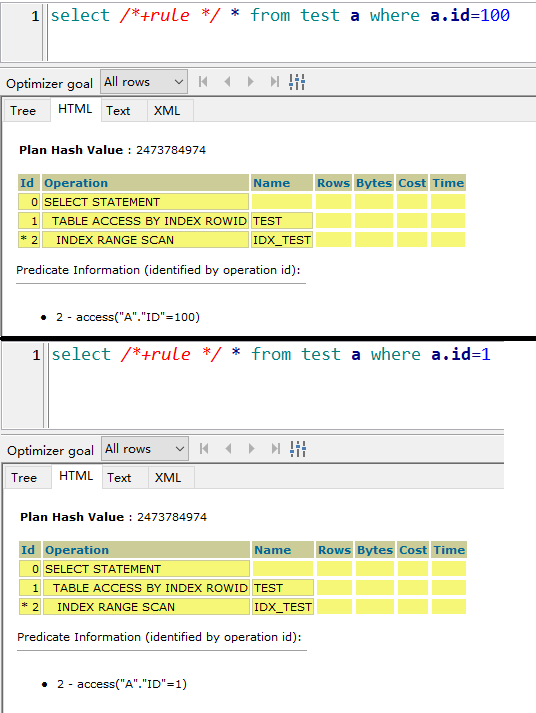
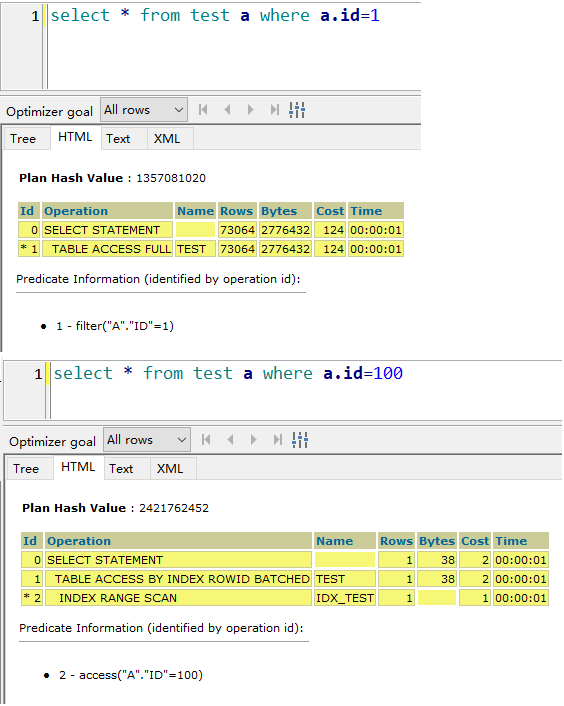
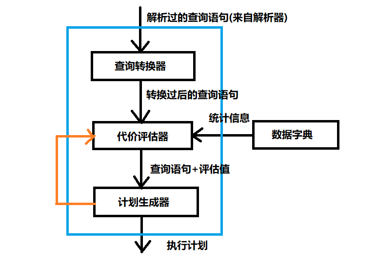
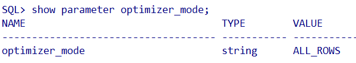
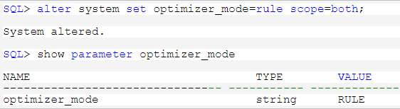

# RBO CBO
Oracle中的查询优化器RBO(基于规则)和CBO(基于代价).

    RBO: Rule-Based Optimization 基于规则的优化器
    CBO: Cost-Based Optimization 基于代价的优化器
基于规则, 就是对于SQL的使用, 有一套固定的规则, 无论数据怎么变, 只要SQL是按照这一规则写的, 就一定是生成相同的执行计划.
而基于代价的优化器, 当我们的数据变化时, 即使同样地SQL写法, 也有可能出现不同的执行策略.

举个栗子:  

    SQL>create table test as select 1 id ,object_name from dba_objects;
    Table created.
    SQL> create index idx_test on test(id);
    Index created.
    SQL> update test set id=100 where rownum =1;
    1 row updated.
    SQL> select id, count(1) from test group by id;

        ID     COUNT(1)
    ---------- ----------
       100          1
         1      50314

可见, 在表中ID=100拥有1条数据,而ID=1的有5万多, 而且这个字段已经加上了索引,索引名称(idx_test).

当我们使用RBO模式时,由于走规则, 无论id=1,id=100,都走范围索引,id=1的数据实在太多,几乎每一条都符合谓语条件,走范围索引只会增加额外的开销.

当使用CBO模式时,系统会自动选择代价较低的方案,如下图所示,id=1走全表扫描,id=100走区间索引扫描,一模一样的语法,却使用两种方案,这是CBO对于SQL执行的优化.
  

## CBO优化器的组件
**查询转化器**
等价的改变查询语句的形式，以便产生更好的执行计划。它决定是否重写用户的查询（包括视图合并、谓词推进、非嵌套子查询/子查询反嵌套、物化视图重写），以生成更好的查询计划。
**代价评估器**
评估器通过复杂的算法结合来统计信息的三个值来评估各个执行计划的总体成本：选择性（Selectivity）、基数（Cardinality）、成本（Cost）.

计划生成器会考虑可能的访问路径（Access Path）、关联方法和关联顺序，生成不同的执行计划，让查询优化器从这些计划中选择出执行代价最小的一个计划。
**计划生成器**
计划生成器就是生成大量的执行计划，然后选择其总体代价或总体成本最低的一个执行计划。

由于不同的访问路径、连接方式和连接顺序可以组合，虽然以不同的方式访问和处理数据，但是可以产生同样的结果.

## 查看Oracle优化器
  

## 修改Oracle优化器
Oracle优化器可以从系统级别,会话级别,语句级别修改.  

    其中optimizer_mode可以选择的值有： first_rows_n,all_rows.  其中first_rows_n又有first_rows_1000, first_rows_100, first_rows_10, first_rows_1

    在Oracle 9i中，优化器模式可以选择first_rows_n,all_rows, choose, rule 等模式：
        RULE:基于规则
        CHOOSE:指的是当一个表或或索引有统计信息，则走CBO的方式，如果表或索引没统计信息，表又不是特别的小，而且相应的列有索引时，那么就走索引，走RBO的方式。
        FIRST ROWS：它与Choose方式是类似的，所不同的是当一个表有统计信息时，它将是以最快的方式返回查询的最先的几行，从总体上减少了响应时间。

All Rows: 10g中的默认值，也就是我们所说的Cost的方式，当一个表有统计信息时，它将以最快的方式返回表的所有的行，从总体上提高查询的吞吐

虽然Oracle 10g中不再支持RBO，Oracle 10g官方文档关于optimizer_mode参数的只有first_rows和all_rows.但是依然可以设置 optimizer_mode为rule或choose，估计是ORACLE为了过渡或向下兼容考虑。
**系统级别**
  
**会话级别**
会话级别修改优化器模式，只对当前会话有效，其它会话依然使用系统优化器模式。

    SQL> alter session set optimizer_mode=first_rows_100;
**语句级别**
例如:  

    select /*+ rule */ * from dba_objects where rownum <= 10;

