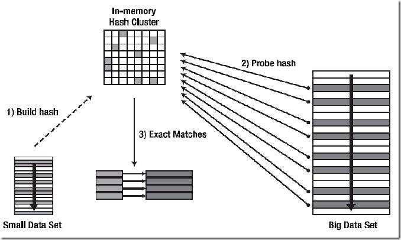
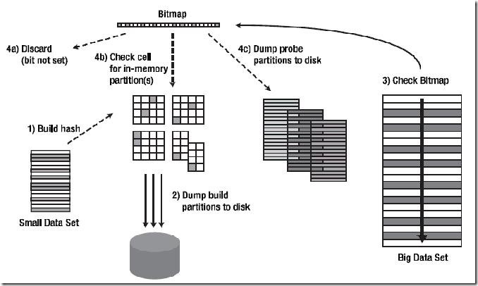

# 表连接方式

JOIN 关键字用于将两张表作连接，一次只能连接两张表，JOIN 操作的各步骤一般是串行的（在读取做连接的两张表的数据时可以并行读取）；

表（row source）之间的连接顺序对于查询效率有很大的影响，对首先存取的表（驱动表）先应用某些限制条件（Where过滤条件）以得到一个较小的row source，可以使得连接效率提高。

## 驱动表（Driving Table）与匹配表（Probed Table）

驱动表（Driving Table）：

表连接时首先存取的表，又称外层表（Outer Table），这个概念用于 NESTED LOOPS（嵌套循环） 与 HASH JOIN（哈希连接）中；

如果驱动表返回较多的行数据，则对所有的后续操作有负面影响，故一般选择小表（应用Where限制条件后返回较少行数的表）作为驱动表。

匹配表（Probed Table）：

又称为内层表（Inner Table），从驱动表获取一行具体数据后，会到该表中寻找符合连接条件的行。故该表一般为大表（应用Where限制条件后返回较多行数的表）。

表连接的几种方式:  
$$
\begin{matrix}
SORT \quad MERGE \quad JOIN&排序-合并连接\\
NESTED \quad LOOPS&嵌套循环\\
HASH \quad JOIN&哈希连接\\
CARTESIAN \quad PRODUCT&笛卡尔积\\
\end{matrix}
$$
**Sort Merge Join (排序-合并连接)**:
假设有查询：select a.name, b.name from table_A a join table_B b on (a.id = b.id)
内部连接过程：

    a) 生成 row source 1 需要的数据，按照连接操作关联列（如示例中的a.id）对这些数据进行排序
    b) 生成 row source 2 需要的数据，按照与 a) 中对应的连接操作关联列（b.id）对数据进行排序
    c) 两边已排序的行放在一起执行合并操作（对两边的数据集进行扫描并判断是否连接）

延伸：
如果示例中的连接操作关联列 a.id，b.id 之前就已经被排过序了的话，连接速度便可大大提高，因为排序是很费时间和资源的操作，尤其对于有大量数据的表。
故可以考虑在 a.id，b.id 上建立索引让其能预先排好序。不过遗憾的是，由于返回的结果集中包括所有字段，所以通常的执行计划中，即使连接列存在索引，也不会进入到执行计划中，除非进行一些特定列处理（如仅仅只查询有索引的列等）。
排序-合并连接的表无驱动顺序，谁在前面都可以；
排序-合并连接适用的连接条件有： <   <=   =   >   >= ，不适用的连接条件有： `< >`   like
**Nested Loops (嵌套循环)**:
内部连接过程：

    a) 取出 row source 1 的 row 1（第一行数据），遍历 row source 2 的所有行并检查是否有匹配的，取出匹配的行放入结果集中
    b) 取出 row source 1 的 row 2（第二行数据），遍历 row source 2 的所有行并检查是否有匹配的，取出匹配的行放入结果集中
    c) ……

若 row source 1 （即驱动表）中返回了 N 行数据，则 row source 2 也相应的会被全表遍历 N 次。
因为 row source 1 的每一行都会去匹配 row source 2 的所有行，所以当 row source 1 返回的行数尽可能少并且能高效访问 row source 2（如建立适当的索引）时，效率较高。

延伸：
嵌套循环的表有驱动顺序，注意选择合适的驱动表。
嵌套循环连接有一个其他连接方式没有的好处是：可以先返回已经连接的行，而不必等所有的连接操作处理完才返回数据，这样可以实现快速响应。

应尽可能使用限制条件（Where过滤条件）使驱动表（row source 1）返回的行数尽可能少，同时在匹配表（row source 2）的连接操作关联列上建立唯一索引（UNIQUE INDEX）或是选择性较好的非唯一索引，此时嵌套循环连接的执行效率会变得很高。若驱动表返回的行数较多，即使匹配表连接操作关联列上存在索引，连接效率也不会很高。
**Hash Join (哈希连接)**:
哈希连接只适用于等值连接（即连接条件为  =  ）
HASH JOIN对两个表做连接时并不一定是都进行全表扫描，其并不限制表访问方式；

内部连接过程简述：

    a) 取出 row source 1（驱动表，在HASH JOIN中又称为Build Table） 的数据集，然后将其构建成内存中的一个 Hash Table（Hash函数的Hash KEY就是连接操作关联列），创建Hash位图（bitmap）
    b) 取出 row source 2（匹配表）的数据集，对其中的每一条数据的连接操作关联列使用相同的Hash函数并找到对应的key里的数据在 Hash Table 中的位置，在该位置上检查能否找到匹配的数据

HASH JOIN的三种模式：

    OPTIMAL HASH JOIN
    ONEPASS HASH JOIN
    MULTIPASS HASH JOIN

1. OPTIMAL HASH JOIN

   OPTIMAL 模式是从驱动表（也称Build Table）上获取的结果集比较小，可以把根据结果集构建的整个Hash Table都建立在用户可以使用的内存区域里。

    连接过程简述：

        Ⅰ：首先对Build Table内各行数据的连接操作关联列使用Hash函数，把Build Table的结果集构建成内存中的Hash Table。如图所示，可以把Hash Table看作内存中的一块大的方形区域，里面有很多的小格子，Build Table里的数据就分散分布在这些小格子中，而这些小格子就是Hash Bucket。
        Ⅱ：开始读取匹配表（Probed Table）的数据，对其中每行数据的连接操作关联列都使用同上的Hash函数，定位Build Table里使用Hash函数后具有相同值数据所在的Hash Bucket。
        Ⅲ：定位到具体的Hash Bucket后，先检查Bucket里是否有数据，没有的话就马上丢掉匹配表（Probed Table）的这一行。如果里面有数据，则继续检查里面的数据（驱动表的数据）是否和匹配表的数据相匹配。
2. ONEPASS HASH JOIN

    从驱动表（也称Build Table）上获取的结果集较大，无法将根据结果集构建的Hash Table全部放入内存中时，会使用 ONEPASS 模式。

    连接过程简述：

        Ⅰ：对Build Table内各行数据的连接操作关联列使用Hash函数，根据Build Table的结果集构建Hash Table后，由于内存无法放下所有的Hash Table内容，将导致有的Hash Bucket放在内存里，有的Hash Bucket放在磁盘上，无论放在内存里还是磁盘里，Oracle都使用一个Bitmap结构来反映这些Hash Bucket的状态（包括其位置和是否有数据）。
        Ⅱ：读取匹配表数据并对每行的连接操作关联列使用同上的Hash函数，定位Bitmap上Build Table里使用Hash函数后具有相同值数据所在的Bucket。如果该Bucket为空，则丢弃匹配表的这条数据。如果不为空，则需要看该Bucket是在内存里还是在磁盘上。
        如果在内存中，就直接访问这个Bucket并检查其中的数据是否匹配，有匹配的话就返回这条查询结果。
        如果在磁盘上，就先把这条待匹配数据放到一边，将其先暂存在内存里，等以后积累了一定量的这样的待匹配数据后，再批量的把这些数据写入到磁盘上（上图中的 Dump probe partitions to disk）。
        Ⅲ：当把匹配表完整的扫描了一遍后，可能已经返回了一部分匹配的数据了。接下来还有Hash Table中一部分在磁盘上的Hash Bucket数据以及匹配表中部分被写入到磁盘上的待匹配数据未处理，现在Oracle会把磁盘上的这两部分数据重新匹配一次，然后返回最终的查询结果。
3. MULTIPASS HASH JOIN

    当内存特别小或者相对而言Hash Table的数据特别大时，会使用 MULTIPASS 模式。MULTIPASS会多次读取磁盘数据，应尽量避免使用该模式。

**Cartesian Product (笛卡尔积)**:
两表的相乘
