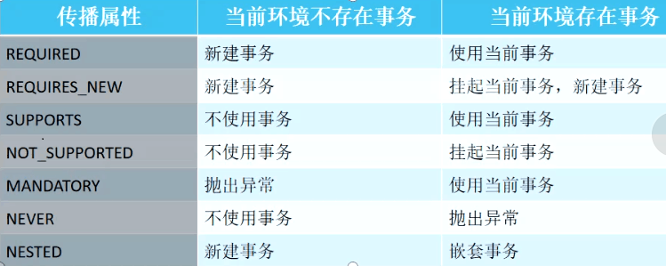

# 数据库事务
## 1.ACID特性
原子性(Atomicity)
一致性(Consistency)
隔离性(Isolation)
持久性(Duration)

## 2.隔离级别
Read Uncommitted
Read Committed
Repeatable Read
Serializable

## 3.事务并发问题
脏读
不可重复读
幻读

## 4.事务传播
已经在学习计划中写过了...

## 5.SpringBoot对事务的支持
1. 加@Transactional的方法不能是private和protected修饰，private会直接报编译错误，protected不会报错。但是事务不起作用。

2. @Transactional可以放在Controller下面直接起作用，看到网上好多同学说要放到@Component下面或者@Service下面，经过试验，可以不用放在这两个下面也起作用。

3. @Transactional引入包问题，它有两个包: import javax.transaction.Transactional; 和 import org.springframework.transaction.annotation.Transactional; 这两个都可以用，对比了一下他们两个的方法和属性，发现后面的比前面的强大。建议后后面的。

4. @Transactional采用AOP实现的。

    在进行方法调用的时候，发现这个方法有事务注解，AOP首先会检测到，然后用代理类采用反射机制进行调用。

    1. 首先调用了CglibAopProxy.intercept()方法。

    2. 接下来调用ReflectiveMethodInvocation.proceed()方法，

    3. TransactionInterceptor.invoke()

    4. TransactionAspectSupport.invokeWithinTransaction（）

    5. TransactionAspectSupport.createTransactionIfNecessary（）

    6. AbstractPlatformTransactionManager.getTransaction（），创建了一个新的事务。

5. PlatformTransactionManager 这个接口中定义了三个方法 getTransaction创建事务，commit 提交事务，rollback 回滚事务。她的实现类是 AbstractPlatformTransactionManager这个。

6. 在Transactional这个中，有一个参数 Propagation的属性，里面有七种类型，REQUIRED，REQUIRES_NEW,NESTED,这三个都是新建事务，其他的都不创建事务。

7. 当一个方法中嵌套使用@Transactional。如果没有设置属性 Propagation，默认为REQUIRED,她只会在上下文创建一个事务。当设置属性为REQUIRES_NEW的时候，她会创建一个新的事务。

8. try catch的使用，当一个事务中如果对异常进行了捕获，而且没有抛出异常的情况下，事务是不起作用的，只有抛出异常，事务会自己trycatch,然后进行回滚操作。

9. 问题注意：
如果使用Mysql数据库，需要注意创建表的引擎。支持InnoDD,默认创建表是 MyISAM

